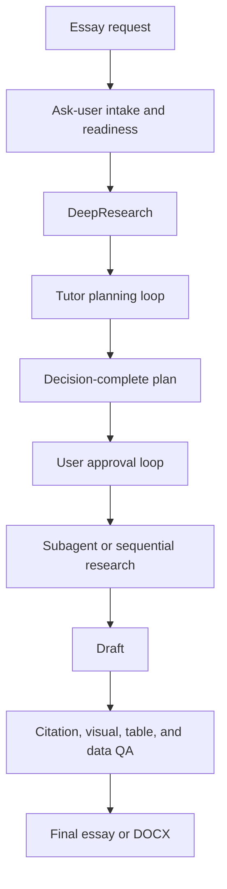

# Essay Tutor Codex Skill

`essay-tutor` is a Codex Skill for producing academic essays through a controlled workflow: ask-user intake, Plan Mode-aware tutor planning, DeepResearch, user approval, evidence appraisal, citation-managed drafting, critical analysis, visual/table/data handling, DOCX formatting, and final QA.

The Skill is designed for literature-backed academic writing where accuracy, traceability, user-confirmed requirements, and critical discussion matter more than fast generic drafting.

## What It Does

| Area | Capability |
| --- | --- |
| Intake | Interactively confirms topic, word or page limit, academic level, citation style, source base, rubric, language, and output requirements before detailed planning, preferring native ask-user UI when available. |
| Planning | Uses a tutor-style planning loop to explain tradeoffs, ask targeted plan decisions, and produce a subtitle-level plan with thesis, section functions, citation strategy, visual strategy, and critical-thinking targets. |
| Approval loop | Prevents final drafting until the user approves the plan unless the user explicitly skips planning. |
| Research | Builds a verified literature map using official course material, required readings, primary papers, reviews, textbooks, and academic databases. |
| Drafting | Writes from the approved plan with calibrated claims and paragraph-level argument logic. |
| Revision | Distills feedback into transferable language rules, deletes low-value content, and reallocates capacity to argument, evidence strength, alternatives, and scope. |
| Citation | Supports intensive-reading citations and broad-support synthesis citations with metadata validation and claim-led parenthetical citation prose by default. |
| Critical thinking | Requires explicit critical-analysis tasks in body paragraphs and a mostly analytic discussion. |
| Visuals and data | Handles figure permission checks, generated mechanism schematics, academic tables, and GraphPad Prism-style data workflows. |
| DOCX | Formats Word essays with Arial, 2.5 cm margins, 1.5 line spacing, justified body text, centered titles, and left-aligned subheadings. |
| QA | Checks unsupported claims, fake citations, overclaiming, weak discussion, figure permission, table quality, references, and formatting. |

## Install

```bash
mkdir -p ~/.codex/skills
git clone https://github.com/OctavianYimingZhang/Essay-Tutor.git \
  ~/.codex/skills/essay-tutor
cd ~/.codex/skills/essay-tutor
python3 scripts/skill_maintenance.py doctor
```

## Use

```text
$essay-tutor
Plan a 2,000-word academic essay on seasonal affective disorder as a model of seasonal light signalling. Use APA 7 and do not draft until I approve the plan.
```

## Core Workflow



## Evidence Boundary

The Skill prioritizes:

1. The exact essay question, rubric, and learning outcomes.
2. Official lecture slides, official notes, and handouts.
3. Required readings and reading-list papers.
4. Primary peer-reviewed papers.
5. Systematic reviews, meta-analyses, major reviews, and clinical guidelines.
6. Textbooks and official academic sources.
7. Additional peer-reviewed papers found by search.

It does not permit invented citations, fake statistics, unsupported mechanisms, unverified DOI/PMID metadata, or paper-figure reuse without license or permission.

## Interactive Intake

The Skill does not create detailed plans from guessed requirements. If academic level, citation style, word or page limit, output format, source base, language, or rubric status is not stated or verifiable from supplied material, it asks the user before planning.

When native ask-user UI is available, the Skill uses it for material requirement and plan decisions instead of bulk plain-text questionnaires. It uses one to three meaningful choices per turn, explains why the choice matters, and keeps cosmetic preferences out of the ask-user flow.

## Plan Mode-Aware Planning

The Skill uses native Codex Plan Mode when the current session provides it, but it does not claim to switch modes by itself. In Plan Mode, the final essay plan is emitted as a `<proposed_plan>` only after open decisions are resolved. Outside Plan Mode, the Skill follows the same tutor-style planning loop in normal chat and waits for explicit approval before drafting.

## Revision Discipline

The Skill treats major teacher edits and model essays as sources of transferable writing behaviour only. It does not copy example wording or import topic-specific claims. Large deletions target low-value background, repeated aims, source-route narration, avoidable author-led citation prose, unsupported intensifiers, duplicated result/table prose, and detail catalogues without inference. The freed capacity should be spent on mechanism, interpretation, alternative explanations, evidence-strength calibration, claim scope, and direct links back to the question.

## Optional Integrations

The Skill can use external tools when available:

- CSL-compatible formatters or Citation.js for citation rendering.
- PubMed, Crossref, DOI.org, publisher pages, and Google Scholar for source discovery and validation.
- Scholar Sidekick MCP or a citation-management Skill for identifier resolution and bibliography checks.
- GraphPad Prism for final data figures when the user supplies data and Prism is available.
- Image generation or BioRender-style schematic workflows for original mechanism figures.

Third-party code is not bundled unless its license permits reuse. External tools should be invoked or documented rather than copied into the Skill package without license review.

## Local Validation

```bash
python3 scripts/skill_maintenance.py doctor
python3 scripts/validate_essay_tutor.py --strict
```

## License

MIT License. See `LICENSE`.
