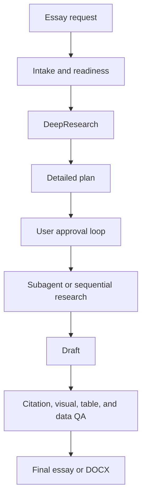

# Essay Tutor Codex Skill

`essay-tutor` is a Codex Skill for producing academic essays through a controlled workflow: intake, DeepResearch, detailed planning, user approval, evidence appraisal, citation-managed drafting, critical analysis, visual/table/data handling, DOCX formatting, and final QA.

The Skill is designed for literature-backed academic writing where accuracy, traceability, and critical discussion matter more than fast generic drafting.

## What It Does

| Area | Capability |
| --- | --- |
| Intake | Collects topic, word limit, academic level, citation style, source base, rubric, AI-use policy, and output requirements. |
| Planning | Produces a subtitle-level plan with thesis, section functions, citation strategy, visual strategy, and critical-thinking targets. |
| Approval loop | Prevents final drafting until the user approves the plan unless the user explicitly skips planning. |
| Research | Builds a verified literature map using official course material, required readings, primary papers, reviews, textbooks, and academic databases. |
| Drafting | Writes from the approved plan with calibrated claims and paragraph-level argument logic. |
| Citation | Supports intensive-reading citations and broad-support synthesis citations with metadata validation. |
| Critical thinking | Requires analytic content in the main body and a mostly analytic discussion. |
| Visuals and data | Handles figure permission checks, generated mechanism schematics, academic tables, and GraphPad Prism-style data workflows. |
| DOCX | Formats Word essays with Arial, 2.5 cm margins, 1.5 line spacing, justified body text, centered titles, and left-aligned subheadings. |
| QA | Checks unsupported claims, fake citations, overclaiming, weak discussion, figure permission, table quality, references, and formatting. |

## Install

```bash
mkdir -p ~/.codex/skills
git clone https://github.com/OctavianYimingZhang/Essay-Tutor.git \
  ~/.codex/skills/essay-tutor
cd ~/.codex/skills/essay-tutor
python3 scripts/skill_maintenance.py doctor
```

## Use

```text
$essay-tutor
Plan a 2,000-word academic essay on seasonal affective disorder as a model of seasonal light signalling. Use APA 7 and do not draft until I approve the plan.
```

## Core Workflow



## Evidence Boundary

The Skill prioritizes:

1. The exact essay question, rubric, and learning outcomes.
2. Official lecture slides, official notes, and handouts.
3. Required readings and reading-list papers.
4. Primary peer-reviewed papers.
5. Systematic reviews, meta-analyses, major reviews, and clinical guidelines.
6. Textbooks and official academic sources.
7. Additional peer-reviewed papers found by search.

It does not permit invented citations, fake statistics, unsupported mechanisms, unverified DOI/PMID metadata, or paper-figure reuse without license or permission.

## Optional Integrations

The Skill can use external tools when available:

- CSL-compatible formatters or Citation.js for citation rendering.
- PubMed, Crossref, DOI.org, publisher pages, and Google Scholar for source discovery and validation.
- Scholar Sidekick MCP or a citation-management Skill for identifier resolution and bibliography checks.
- GraphPad Prism for final data figures when the user supplies data and Prism is available.
- Image generation or BioRender-style schematic workflows for original mechanism figures.

Third-party code is not bundled unless its license permits reuse. External tools should be invoked or documented rather than copied into the Skill package without license review.

## Local Validation

```bash
python3 scripts/skill_maintenance.py doctor
python3 scripts/validate_essay_tutor.py --strict
```

## License

MIT License. See `LICENSE`.
