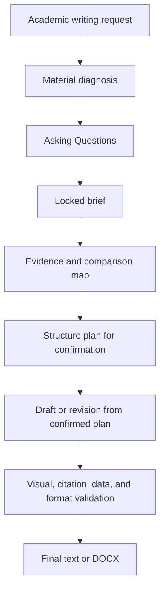

# Essay Tutor Codex Skill

`essay-tutor` is a Codex Skill for academic writing tasks that benefit from interaction-first brief reconstruction, evidence mapping, structure planning, citation control, data or figure handling, DOCX formatting, and final quality checks.

The Skill is designed for assessed essays, lab reports, literature reviews, proposals, case studies, discussion sections, revision tasks, and data-supported reports where accuracy, traceability, examiner fit, and clear academic prose matter.

## What It Does

| Area | Capability |
| --- | --- |
| Intake | Diagnoses assignment materials, user drafts, generated drafts, rubrics, examples, screenshots, and preferences before planning. |
| Readiness | Marks requirements as verified from materials, inferred from context, user-confirmed, user preference needed, or evidence gap. |
| Planning | Creates confirmed section-by-section and final plans that explain argument flow, evidence burden, citation quantity, critical-analysis stance, format requirements, output density, and figure/table/data needs. |
| Research | Builds a source and evidence map from course material, required readings, user files, authoritative academic sources, and verified external literature. |
| Drafting | Writes from the structure plan with paragraph-level claim, evidence, interpretation, boundary, and link-back logic. |
| Revision | Improves question fit, evidence fit, interpretation, citation prose, density, and reader flow. |
| Citation | Supports claim-led citation placement, sentence-level evidence mapping, metadata checks, and reference-list consistency in the requested style. |
| Visuals and data | Uses figures, tables, diagrams, data outputs, and GraphPad-style workflows when they improve comparison, method clarity, mechanism explanation, synthesis, or result interpretation. |
| DOCX | Formats Word documents with Arial, 2.5 cm margins, 1.5 line spacing, justified body text, centred titles, left-aligned subheadings, and black academic text by default. |
| QA | Checks requirement fit, evidence support, citation consistency, structure, density, visual/table usefulness, data accuracy, and output formatting. |

## Install

```bash
mkdir -p ~/.codex/skills
git clone https://github.com/OctavianYimingZhang/Essay-Tutor.git \
  ~/.codex/skills/essay-tutor
cd ~/.codex/skills/essay-tutor
python3 scripts/skill_maintenance.py doctor
```

## Use

```text
$essay-tutor
Help me plan an assessed essay from the supplied brief and readings. Diagnose the materials, ask plan-changing questions, then make a structure plan for my confirmation.
```

```text
$essay-tutor
Use the supplied lab handbook, rubric, spreadsheet, and GraphPad Prism file to produce a Manchester Harvard lab report in English DOCX format.
```

## Core Workflow



## Evidence Boundary

The Skill prioritises:

1. The exact question, brief, rubric, learning outcomes, and local style guidance.
2. Official lecture slides, official notes, handouts, and required readings.
3. User-provided papers, datasets, analysis outputs, and teacher feedback.
4. Primary peer-reviewed studies for specific empirical claims.
5. Reviews, meta-analyses, textbooks, and guidelines for synthesis or orientation.
6. Additional peer-reviewed literature found through academic search.

Claims, statistics, mechanisms, citation metadata, and figure content are grounded in the current source base or recorded as evidence gaps for revision.

## Planning And Drafting

The Skill uses interaction-first planning for new essay creation:

- It expects Codex Plan Mode for native Asking Questions because `request_user_input` is a Plan Mode tool.
- It generates `request_user_input` payloads with `scripts/build_intake_questions.py` before asking plan-changing questions.
- It asks for citation quantity and format requirements before planning when those choices are not supplied by the brief.
- It presents each detailed section plan and the CriticalAnalysisPlan for user feedback before the final integrated plan.
- It compares user drafts with generated results when both are supplied before planning revision.
- It plans essays with natural section rationales, not mechanical planning fields.
- It drafts from the confirmed plan.
- In Codex Plan Mode, it uses the required `<proposed_plan>` format for formal plans.

## Density And Style

The Skill chooses output density by:

- rubric or examiner emphasis;
- concept difficulty;
- evidence volume and conflict;
- analysis and uncertainty to explain;
- reader context needed;
- available assignment space;
- usefulness of figures, tables, or data displays.

Teacher feedback and exemplars are used to extract transferable structure, tone, density, and reporting patterns. Topic-specific claims are grounded in the current assignment sources.

## Optional Integrations

The Skill can use external tools when available:

- citation managers or CSL-compatible formatters for bibliography work;
- PubMed, Crossref, DOI.org, publisher pages, Google Scholar, or library databases for source discovery and validation;
- GraphPad Prism, spreadsheet tools, or local scripts for data analysis;
- image generation, BioRender-style workflows, or document tools for figures and file output.

Third-party code stays outside the Skill package unless the licence supports bundling.

## Local Validation

```bash
python3 scripts/skill_maintenance.py doctor
python3 scripts/validate_essay_tutor.py --strict
```

## License

MIT License. See `LICENSE`.
