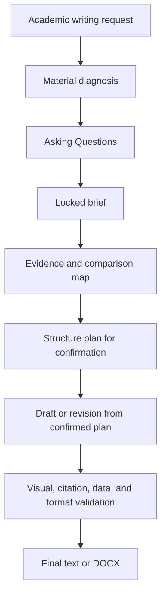

# Essay Tutor Codex Skill

`essay-tutor` is the Index skill for a multiple-skill Essay Tutor system. It routes academic writing and assessed coursework tasks to focused skills for interaction-first brief reconstruction, evidence mapping, structure planning, citation control, data or figure handling, figure legends, poster and presentation planning, interactive website planning, DOCX formatting, and final quality checks.

The Skill is designed for assessed essays, lab reports, posters, presentations, interactive websites, figure generation tasks, figure legends, literature reviews, proposals, case studies, discussion sections, revision tasks, and data-supported reports where accuracy, traceability, examiner fit, and clear academic communication matter.

## Focused Skills

Run `python3 scripts/install_multiple_skills.py` after cloning or updating this package to copy these focused skills into the top-level Codex skills directory.

| Skill | Use |
| --- | --- |
| `essay-tutor` | Route broad or mixed coursework requests to the correct focused workflow. |
| `essay-tutor-intake-planning` | Reconstruct the brief, ask plan-changing questions, lock requirements, and build section or task-specific plans. |
| `essay-tutor-research-citation` | Build source maps, choose citation density, support claims, and check references. |
| `essay-tutor-draft-revise` | Draft or revise academic prose from a confirmed plan and evidence map. |
| `essay-tutor-critical-analysis` | Add evaluative stance, limitations, synthesis, and CriticalAnalysisPlan insertions. |
| `essay-tutor-lab-data` | Handle lab reports, analysis tools, statistical methods, Results, figures, and tables. |
| `essay-tutor-figures-legends` | Specify source-backed figures, generation plans, captions, and figure legends. |
| `essay-tutor-posters-presentations` | Plan posters, slide decks, storyboards, visual hierarchy, notes, and scripts. |
| `essay-tutor-website-coursework` | Plan interactive academic websites, user journeys, navigation, media, and citations. |
| `essay-tutor-docx-formatting` | Format and inspect Word/DOCX academic documents. |
| `essay-tutor-final-qa` | Check final requirement fit, citations, structure, data, visuals, and formatting. |

## What It Does

| Area | Capability |
| --- | --- |
| Intake | Diagnoses assignment materials, user drafts, generated drafts, rubrics, user-supplied exemplars, sample answers, teacher examples, screenshots, and preferences before planning. |
| Readiness | Marks requirements as verified from materials, inferred from context, user-confirmed, user preference needed, or evidence gap. |
| Planning | Creates plan-first, paragraph-level or task-specific plans that explain argument flow, visual hierarchy, interaction flow, paragraph output path when relevant, proof logic, citation quantity, critical-analysis placement, format requirements, output density, and figure/table/data needs. |
| Research | Builds a source and evidence map from course material, required readings, user files, authoritative academic sources, and verified external literature. |
| Drafting | Writes from the structure plan with paragraph-level claim, evidence, interpretation, boundary, and link-back logic. |
| Revision | Improves question fit, evidence fit, interpretation, citation prose, density, and reader flow. |
| Citation | Supports claim-led citation placement, sentence-level evidence mapping, metadata checks, and reference-list consistency in the requested style. |
| Visuals and data | Uses figures, tables, diagrams, data outputs, GraphPad Prism, R Studio, Python, MatLab, spreadsheets, figure generation, and figure legends when they improve comparison, method clarity, mechanism explanation, synthesis, or result interpretation. |
| Task-specific outputs | Plans posters, presentations, interactive websites, figure generation tasks, and figure legends with dedicated Ask Question workflows rather than forcing essay architecture onto every assignment. |
| DOCX | Formats Word documents as submit-ready academic drafts with Arial, 2.5 cm margins, 1.5 line spacing, justified body text, user-selected main title size, centred titles, left-aligned subheadings, black academic text, and Nature-style journal tables. |
| QA | Checks requirement fit, evidence support, citation consistency, structure, density, visual/table usefulness, data accuracy, and output formatting. |

## Install

```bash
mkdir -p ~/.codex/skills
git clone https://github.com/OctavianYimingZhang/Essay-Tutor.git \
  ~/.codex/skills/essay-tutor
cd ~/.codex/skills/essay-tutor
python3 scripts/skill_maintenance.py doctor
python3 scripts/install_multiple_skills.py
python3 scripts/install_multiple_skills.py --check
```

## Use

```text
$essay-tutor
Help me plan an assessed essay from the supplied brief and readings. Diagnose the materials, ask plan-changing questions, then make a structure plan for my confirmation.
```

```text
$essay-tutor-intake-planning
Reconstruct this assignment brief, ask the missing plan-changing questions, and build a section-by-section plan.
```

```text
$essay-tutor
Use the supplied lab handbook, rubric, spreadsheet, and GraphPad Prism file to produce a Manchester Harvard lab report in English DOCX format.
```

```text
$essay-tutor-lab-data
Check this spreadsheet and Prism output before writing the Results section.
```

```text
$essay-tutor
Plan an assessed academic poster from the brief, dataset, and example poster. Ask the task-specific questions before making the poster story plan.
```

```text
$essay-tutor
Help me create a figure and complete figure legend for this lab report. Confirm the source basis, analysis method, and legend detail before drafting it.
```

## Core Workflow



## Evidence Boundary

The Skill prioritises:

1. The exact question, brief, rubric, learning outcomes, and local style guidance.
2. Official lecture slides, official notes, handouts, and required readings.
3. User-provided papers, datasets, analysis outputs, and teacher feedback.
4. Primary peer-reviewed studies for specific empirical claims.
5. Reviews, meta-analyses, textbooks, and guidelines for synthesis or orientation.
6. Additional peer-reviewed literature found through academic search.

Claims, statistics, mechanisms, citation metadata, and figure content are grounded in the current source base or recorded as evidence gaps for revision.

## Planning And Drafting

The Skill uses interaction-first planning for new academic coursework:

- It expects Codex Plan Mode for native Asking Questions because `request_user_input` is a Plan Mode tool.
- It displays the relevant brief, paragraph, format, or critical-analysis plan before every Asking Questions batch.
- It generates `request_user_input` payloads with `scripts/build_intake_questions.py` before asking plan-changing questions.
- It asks for task type when the output could be an essay, lab report, poster, presentation, interactive website, figure generation task, or figure legend.
- It asks for citation quantity as an approximate count plus density when those choices are not supplied by the brief.
- It generates format options from context, normally distinguishing chat text, DOCX, LaTeX, and user-specified output.
- It asks for typography, font size, margins, line spacing, title style, and reference formatting when DOCX, Word, LaTeX, or formatted output is selected.
- It asks lab-report users which analysis tool, statistical or model method, and analysis scope to use before writing Results when those details are not verified from the brief or analysis output.
- It asks poster users about canvas, message hierarchy, and visual/data assets; presentation users about timing, audience, and notes or script; website users about output mode, interaction model, and platform constraints.
- It asks figure-generation users about figure purpose, source/data basis, and tool, and asks figure-legend users about legend depth, statistical detail, and source or permission note.
- It presents each detailed section plan as paragraph-level choices with real labels such as Abstract, Introduction, Main Body Paragraph 1, Discussion Paragraph 1, and Conclusion.
- It presents the CriticalAnalysisPlan after the paragraph plan as specific critical moves to insert into body paragraphs or Discussion, with the Discussion plan reserving space for synthesis where needed.
- It compares user drafts with generated results when both are supplied before planning revision.
- It plans essays with natural section rationales, paragraph output paths, and proof logic rather than mechanical planning fields.
- It plans posters, presentations, websites, figures, and legends with task-specific story, visual, interaction, source, and submission constraints instead of essay-only section architecture.
- It drafts from the confirmed plan.
- In Codex Plan Mode, it uses the required `<proposed_plan>` format for formal plans.

## Density And Style

The Skill chooses output density by:

- rubric or examiner emphasis;
- concept difficulty;
- evidence volume and conflict;
- analysis and uncertainty to explain;
- reader context needed;
- available assignment space;
- usefulness of figures, tables, or data displays.

Teacher feedback, user-supplied exemplars, sample answers, model essays, and visual examples are used to extract transferable structure, tone, density, paragraph function, citation density, and reporting patterns. Topic-specific claims are grounded in the current assignment sources.

## Optional Integrations

The Skill can use external tools when available:

- citation managers or CSL-compatible formatters for bibliography work;
- PubMed, Crossref, DOI.org, publisher pages, Google Scholar, or library databases for source discovery and validation;
- GraphPad Prism, R Studio, Python, MatLab, spreadsheet tools, or local scripts for data analysis;
- image generation, BioRender-style workflows, presentation tools, website-building tools, or document tools for figures and file output.

Third-party code stays outside the Skill package unless the licence supports bundling.

## Local Validation

```bash
python3 scripts/install_multiple_skills.py --check
python3 scripts/skill_maintenance.py doctor
python3 scripts/validate_essay_tutor.py --strict
```

## License

MIT License. See `LICENSE`.
